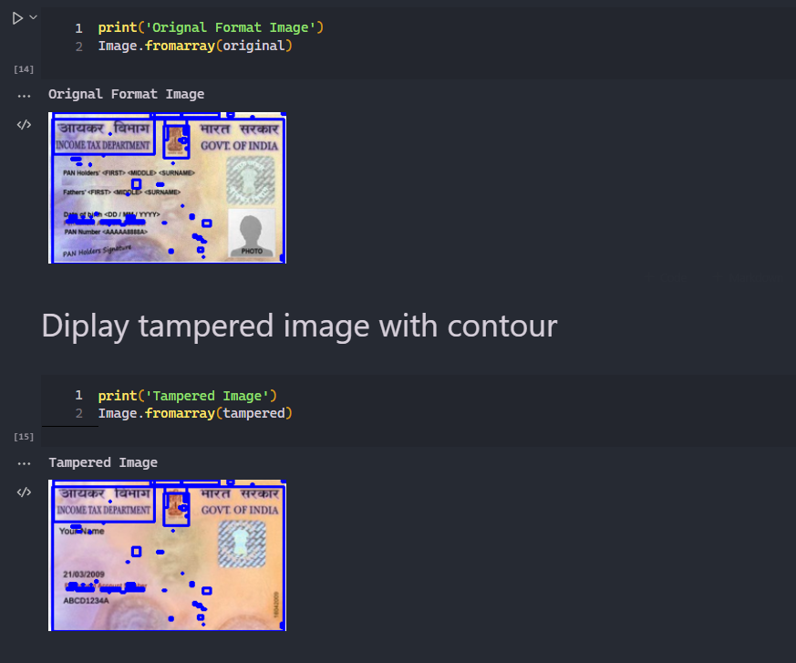
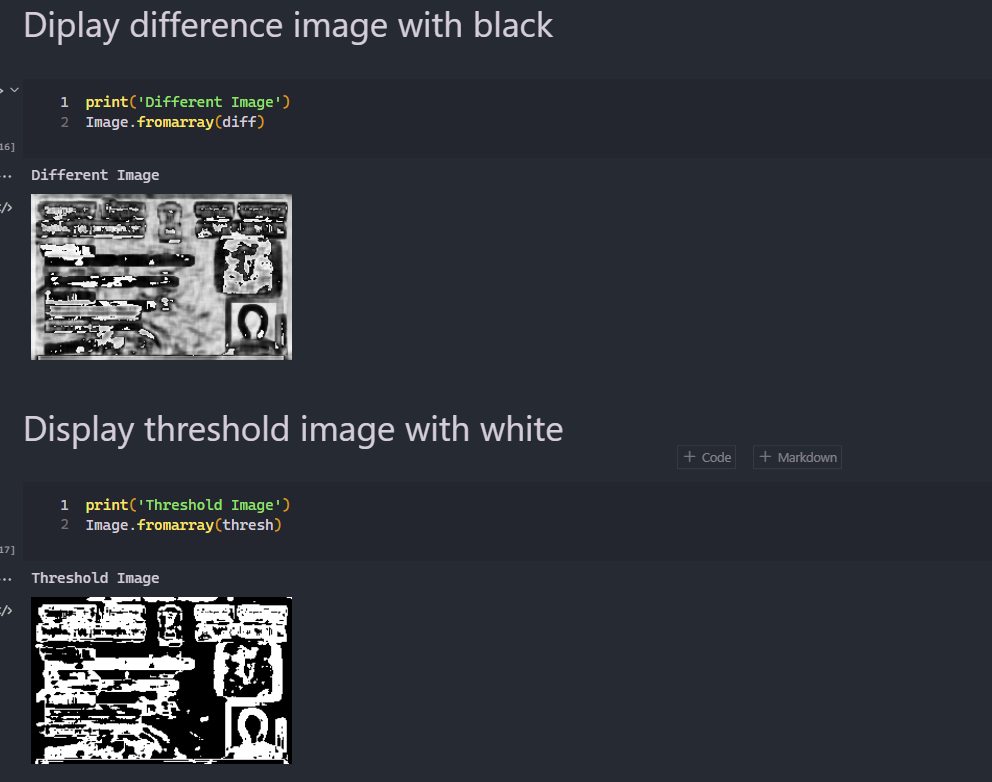

# Pan card Tempering Detector

## This Project Detects wather the pan card is real or duplicated using concept of Data science and Image processing. I have given more detailed note in my jupyter notebook as we proceed ferther step by step





## Steps to run this project

### NOTE: YOU MUST HAVE ***ANACONDA*** INSTALLED ON YOUR COMPUTER

- Open Anaconda Prompt then nevigate to folder where you have clone the projecgt and install the required packages using the following command:

```
    conda install --file requirements. txt
```

- Open anaconda and launch jupyter notebook.

# IMPORTANT

- anaconda jupyter notebook will open `c:\users\username\` folder so it is recommended that you keep your project there otherwise it will not open
